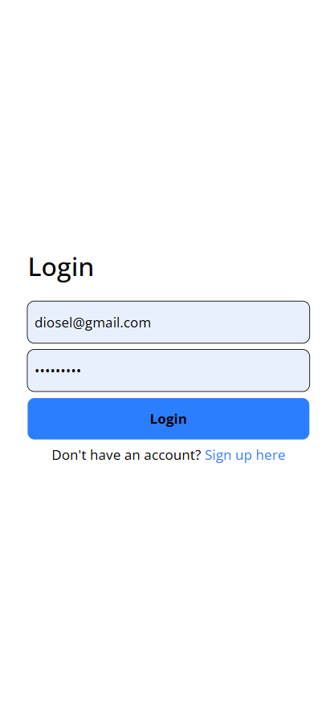
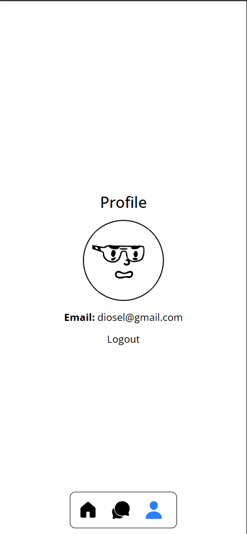
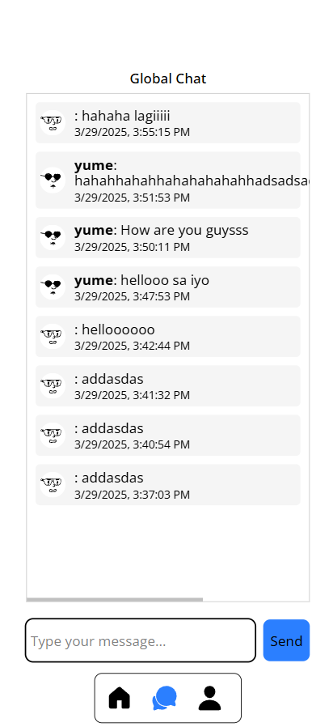

# Global Chat Application

This project is a full-stack application featuring a global chat where users can sign up, log in, and chat with each other in real time. The backend is built with Node.js, Express, and MongoDB, while the frontend is built with React and uses the `fetch` API for HTTP requests. The chat supports user authentication, message sending, and retrieval, with optional real-time updates using polling or WebSockets.

## Table of Contents
- [Features](#features)
- [Tech Stack](#tech-stack)
- [Setup Instructions](#setup-instructions)
  - [Backend Setup](#backend-setup)
  - [Frontend Setup](#frontend-setup)
- [API Documentation](#api-documentation)
  - [POST /api/messages](#post-apimessages)
  - [GET /api/messages](#get-apimessages)
- [Usage](#usage)
  - [Sign Up](#sign-up)
  - [Log In](#log-in)
  - [Chat](#chat)
- [Real-Time Chat with WebSockets (Optional)](#real-time-chat-with-websockets-optional)
- [Screenshots](#screenshots)
- [Contributing](#contributing)
- [License](#license)

## Features
- User authentication (signup, login, logout)
- Global chat where all users can see all messages
- Messages include the sender’s username, profile picture, and timestamp
- Client-side validation for message content
- Rate limiting to prevent abuse
- Optional real-time updates using polling or WebSockets

## Tech Stack
- **Backend**: Node.js, Express, MongoDB, Mongoose, JWT, bcrypt, Winston (logging), Morgan
- **Frontend**: React, React Router, Context API
- **Optional**: Socket.IO for real-time chat

## Setup Instructions

### Backend Setup
1. **Clone the Repository**:
   ```bash
   git clone <your-repo-url>
   cd <your-repo-name>


## Screenshots

Here are some screenshots of the application:




